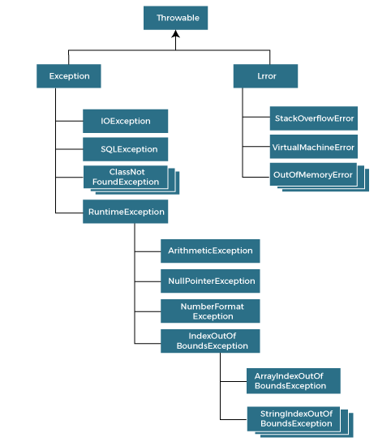

# Java Cheatsheet Final

### Contents

<!-- 1. Method overriding -->

2.  Covariant Return Type
       <!-- 3. Super Keyword -->
       <!-- 3. Instance Initializer -->
          <!-- 3. Final Keyword -->
       <!-- 3. Abstract Class -->
       <!-- 4. Interface -->
    <!-- 3. Multi-Dimensional Array
3.  Jagged Array -->
4.  Recursion
5.  String
6.  StringBuffer
7.  StringBuilder
8.  Exception Handling

## 1. Polymorphism

### 1.1 Method Overriding

Method overriding is when we create new method is child class to replace the super class method. The new method must be of same name, and same parameters.

```java
//Parent.java
public class Parent {
    void hello(String name) {}
}
//Child.java
public class Child extends Parent{
    @Override // <- optional
    // Overriding the parent method
    void hello(String name) {
        System.out.println("Hello, " + name);
    }
}
```

### 1.2 Covariant Return Type

### 1.3 Super Keyword

With super keyword, one can access the properties and methods of it's parent class. It helps when a method is overriden in child class. We can also call parent's constructor with it.

```java
class A {

    A(int age) {
        System.out.println("Age: "+age);
    }

    void name(String name) {
        System.out.println("No Name, just Hello!");
    }
}

class B extends A {

    B(int age) {
        super(age); // calling the parent constructor
    }

    @Override // <- Optional
    void name(String name) {
        super.name(); // with super we can call parent's method as well.
        System.out.println("Just kidding, "+name);
    }
}
```

With this the output will be,

```
Age: [age]
No Name, just Hello!
Just kidding, [name]
```

### 1.4 Instance Initializer

It is used to initialize instance variable. It runs inside the constructor (BTS) after super call.

```java
class A {
    int speed;

    A() {
        // after speed is set
        System.out.println("Speed is "+ speed);
    }

    {
        // setting the speed
        // will run before constructor
        speed = 75;
    }
}
```

Output:

```
Speed is 75
```

### 1.5 Final Keyword

Used when the intention is never to change the value of that said property.

- Class: Can not be inherited
- Variable: Can not be changed
- Method: Can not be overriden
- Parameter: Can not be changed inside the method

```java
final class A {} // final class
class B {
    final int b; // final variable
    final void a() {} // final method
    void a(final int a) {} // final parameter
}
```

## 2. Abstraction

### 2.1 Abstract Class

It is what we use to define structure of a class. We hide the implementation in the parent class and let the child class implement the method. It can have both abstract and non abstact method.

```java
// A.java
public abstract class A {
    String name;
    // Abstract Method
    public abstract String getName();
    // Non abstract method
    public void setName(String name) {
        this.name = name;
    }
}
```

### 2.2 Interface

It is a blueprint of a class. It can contain abstract method and static constants. It is used to achieve full abstraction.

```java
interface Animal {
    void eat(); // declares the method
    void sleep();
}

class Dog implements Animal {
    @Override // <- Optional
    public void eat() { // implements it
        System.out.println("Eating meat...")
    }

    @Override
    public void sleep() {
        System.out.println("Puppy sleeping~!")
    }
}

```

## 3. Encapsulation

It is when we separate group of related classes, interfaces and sub packages in one unit. It is done with folders.

```
--- PackageA
----- ClassA.java
--- PackageB
----- ClassB.java
--- Main.java
```

```java
// ClassA.java
package PackageA;
public class ClassA {
    void yes() {
        System.out.println("YES!");
    }
}

//ClassB.java
package PackageB;
public class ClassB {
    void yes() {
        System.out.println("YES!");
    }
}
```

```java
// Main.java

import PackageA.ClassA; // importing class A from PackageA
import PackageB.ClassB; // importing class B from PackageB

public Main {
    public static void main(String args[]) {
        ClassA ca = new ClassA();
        ClassB cb = new ClassB();
        ca.yes();
        cb.yes();
    }
}
```

#### Access Modifiers for Encapsulation

| Access Modifier | Within Class | Within Package | Outside Package(subclass) | Outside Package |
| :-------------: | :----------: | :------------: | :-----------------------: | :-------------: |
|     Private     |      Y       |       N        |             N             |        N        |
|     Default     |      Y       |       Y        |             N             |        N        |
|    Protected    |      Y       |       Y        |             Y             |        N        |
|     Public      |      Y       |       Y        |             Y             |        Y        |

## 4. Array

### 4.1 Simple array

```java
public class A {
    int nums[] = new int(5); // array with length 5
    nums[0] = 1; // setting index 0 to 1
    nums[1] = 2; // index 1 to 2

    int length = nums.length;
}
```

### 4.2 2D Array

```java
public class A {
    int nums[][] = new int[3][3]; // only define length
    int nums2[][] = { {1,2}, {1,2} }; // with initial value

    nums[0][1] = 35;
}
```

### 4.3 Jagged Array

An array with dynamic column length.

```java
public class Main {
    public static void main(String[] args) {
        // Create a 2-D jagged array with 4 rows
        int[][] jaggedArray = new int[4][];

        // Set the number of columns for each row
        jaggedArray[0] = new int[1];
        jaggedArray[1] = new int[2];
        jaggedArray[2] = new int[3];
        jaggedArray[3] = new int[4];

        // Fill the array with values starting from 1
        int value = 1;
        for (int i = 0; i < jaggedArray.length; i++) {
            for (int j = 0; j < jaggedArray[i].length; j++) {
                jaggedArray[i][j] = value;
                value++;
            }
        }
    }
}
```

### 5. Recursion

Recursion is when a function calls itself over and over until a condition is met.

```java
class FactorialExample {
    // Recursive function to calculate the factorial of a non-negative integer 'n'
    public static int factorial(int n) {
        // Base case: If n is 0 or 1, factorial is 1
        if (n == 0 || n == 1)
            return 1;
        // Recursive case: If n is greater than 1, recursively call factorial function with n-1 and multiply it with n
        else
            return n * factorial(n - 1);
    }
}
public class Main{
    public static void main(String[] args) {
        int num = 5; // Number for which factorial is to be calculated
        // Calculate factorial of 'num' using recursive factorial function
        int result = FactorialExample.factorial(num);
        // Print the result
        System.out.println("Factorial of " + num + " is: " + result);
    }
}
```

### 6. String

#### 6.1 Simple String

`String` is immutable in java meaning we can not change the original value.

```java
public class A {
    String name = "TomTom";
    String department = new String("EE");

    department.concat("E"); // not going to work.
    String fixedDepartment = department.concat("E"); // fixedDepartment is now EEE
}
```

#### 6.2 StringBuffer

`StringBuffer` is mutable and threadsafe.

```java
public class A {
    StringBuffer name = "TomTom";
    StringBuffer department = new String("EE");

    department.append(); // department is now EEE
}
```

#### 6.3 StringBuilder

Similar idea as `StringBuffer` but is not thread safe.

```java
public class A {
    StringBuilder name = "TomTom";
    StringBuilder department = new String("EE");

    department.append(); // department is now EEE
}
```

### 7. Exception Handling

Here is a tree of common/built in Exceptions.


```java
class A {
    String name = null;

    try {
        System.out.println(name.length()); // May throw NullPointerException
    } catch (NullPointerException e) {
        System.out.println("Caught NullPointerException: " + e.getMessage());
    }
}
```

We can stack multiple catch one after another to handle multiple exceptions.
