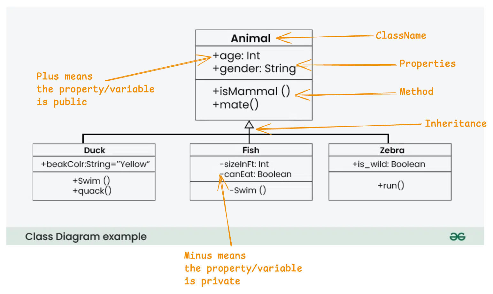

# Java cheatsheet mid

### Contents

1. [Basic Syntax](#1-basic-syntax)
2. [Number Theory](#2-number-theory)
3. [Number Swapping](#3-number-swapping)
4. [Leap Year Logic](#4-leap-year-logic)
5. [Factorial of a Number](#5-factorial-of-a-number)
6. [Palindrome Number](#6-palindrome-number)
7. [Patterns](#7-patterns)
8. [Algorithm](#8-algorithm)
9. [UML](#9-uml-unified-modeling-language-for-java)

### 1. Basic Syntax

#### 1.1 Hello World

```java
public class Hello {
    public static void main(String args[]) {
        System.out.println("Hello World!");
    }
}
```

**Note:** `filename` and `class name` must match for a java program.

#### 1.2 Taking Input

In java inputs can be stored in a variable with the help of `Scanner` class.

```java
import java.util.Scanner; //importing the Scanner class

public class Hello {
    public static void main(String args[]) {
        Scanner sc = new Scanner(System.in);
        int input = sc.nextInt();
        System.out.println("Hello World!");
    }
}
```

For different type of data types, we must use different methods within the `Scanner` class.

Some of the methods for different data types,

- `nextBoolean()` - Reads a boolean value from the user
- `nextByte()` - Reads a byte value from the user
- `nextDouble()` - Reads a double value from the user
- `nextFloat()` - Reads a float value from the user
- `nextInt()` - Reads a int value from the user
- `nextLine()` - Reads a String value from the user
- `nextLong()` - Reads a long value from the user
- `nextShort()` - Reads a short value from the user

#### 1.3 Declaring a new method

```java
public class MethodClass {
    int add(int a, int b) {
        return a + b;
    }

    public static void main(String args[]) {
        MethodClass mc = new MethodClass(); // <- Creating a new object
        mc.add(5, 10); // <- Call the method through the object
    }
}
```

#### 1.4 Static Keyword Use cases

To avoid the previous problem of creating an object before using any type of method or variable from a class, we can use static keyword.

```java
import java.util.Scanner;

public class Palindrome {

    static boolean isPalindrome(int n) {
        [...]
    }

    public static void main(String args[]) {
        [...]

        // Here we are directly calling `isPalindrome` method.
        if (isPalindrome(num)) {
            System.out.println(num + " is a palindrome number.");
        } else {
            System.out.println(num + " is not a palindrome number.");
        }
    }
}

```

#### 1.5 Constructor

Constructor is a special kind of method that runs when a class is initiated. It is primarily used to create an object with initial values.

- Constructor must have the same name as the class.
- Constructor does not have a return type (not even void).

```java
public class Bank {
    // constructor
    Bank() {
        [...]
    }
}
```

#### 1.6 Method overloading

Method overloadding is when we have multiple method that share the same name but is different based on the parameters it accepts. The difference can either be data type of parameters, or the number of parameters.

```java

public class Overload {
    static int add(int a, int b) {
        return a + b;
    }

    static double add(double a, double b) {
        return a + b;
    }

    public static void main(String[] args) {
        // calls the first method because of int data type
        int resultInt = add(1, 2);
        // calls the second method because of double data type
        double resultDouble = add(1.2, 2.2);
    }
}

```

#### 1.7 `this` keyword

`this` keyword is used to access properties and/or method of a class. This is used to primarily avoid naming conflict. `this` access value of object instead of it being global to all objects of a class.

```java
public class Bank {
    String name;

    Bank(String name) {
        // will set the value of instance variable `name`
        this.name = name;
    }
}
```

`this` can also be used to call a constructor of a class.

```java

public class CallConstructor {

    int count;

    CallConstructor() {
        System.out.println("Call Constructor");
    }

    CallConstructor(int count) {
        // Calling the first constructor to print 'Call Constructor'
        this();
        this.count = 10;
    }

    public static void main(String[] args) {
        /* Second construstor is being called
        because of constructor overloading */
        CallConstructor cc = new CallConstructor(10);
    }
}

```

#### 1.8 Inheritance in java

Inheritance is the way we can extend a class to have other properties and methods of a different class.

```java
// Person.java
public class Person {
    String name;
    int age;

    void showAge() {
        [...]
    }
}

// Student.java
public class Student extends Person {
    int id;
    int semester;

    void printInfo() {
        System.out.println(id);
        System.out.println(name); // accessed from `Person` class
        showAge(); // accessed from `Person` class
        System.out.println(semester);
    }
}
```

### 2. Number Theory

#### 2.1 Prime numbers

Prime number is a whole number that is greater than 1 and that can not be exactly divided by any numbers other than 1 and itself.

```java
    // method to check if a number is prime
    boolean isPrime(int n) {
        if (n < 2)
            return false;

        for (int i = 2; i * i < n; i++) {
            if (n % i == 2) {
                return false;
            }
        }

        return true;
    }
```

#### 2.2 Armstrong Number

A positive number that has `n` digits and the sum of each of their digit with a power of `n` is equal to the number.
Example: 153. Since $1^3 + 5^3 + 3^3 = 153$

```java
import java.util.Scanner;

public class Armstrong {

    static boolean isArmstrong(int n) {
        int count = 0, temp = n;

        while (temp > 0) {
            count++;
            temp /= 10;
        }

        long total = 0;
        temp = n;

        while (temp > 0) {
            int ld = temp % 10;
            total += Math.pow(ld, count);
            temp /= 10;
        }

        return total == n;
    }

    public static void main(String[] args) {
        Scanner sc = new Scanner(System.in);

        int num = sc.nextInt();

        sc.close();

        if (isArmstrong(num)) {
            System.out.println(num + " is a Armstrong number.");
        } else {
            System.out.println(num + " is not a Armstrong number.");
        }
    }
}
```

#### 2.3 Goldbach Number

Goldbach numbers state that every even natural number greater than 2 is the sum of two prime numbers.
Example: $4 = 2 + 2$, $6 = 3 + 3$

```java
import java.util.ArrayList;
import java.util.Scanner;

public class Goldbach {

    static boolean isGoldbach(int n) {

        // Goldback numbers must be greater than 2
        if (n < 2)
            return false;

        // Odd numbers can't be goldbach
        if (n % 2 != 0)
            return false;

        boolean[] isPrime = new boolean[n + 1];

        isPrime[0] = false;
        isPrime[1] = false;

        for (int i = 2; i <= n; i++) {
            isPrime[i] = true;
        }

        for (int i = 2; i * i <= n; i++) {
            if (isPrime[i]) {
                for (int j = i * i; j <= n; j += i) {
                    isPrime[j] = false;
                }
            }
        }

        ArrayList<Integer> primes = new ArrayList<Integer>();

        // get the list of prime numbers
        for (int i = 2; i <= n; i++) {
            if (isPrime[i]) {
                primes.add(i);
            }
        }

        // check if a number is goldbach
        for (int p = 0; p < primes.size(); p++) {
            int left = n - primes.get(p);

            if (isPrime[left]) {
                return true;
            }
        }

        return false;

    }

    public static void main(String[] args) {
        Scanner sc = new Scanner(System.in);
        int n = sc.nextInt();
        sc.close();

        if (isGoldbach(n)) {
            [...]
        }
    }
}

```

#### 2.4 Fibonacci

Fibonacci is number series where the current number is the sum of two previous numbers. It usually starts from 0 and 1.

$0, 1, 1, 2, 3, 5, 8, 13, ....$

```java
import java.util.Scanner;

public class Fibonacci {
    public static void main(String args[]) {
        Scanner sc = new Scanner(System.in);

        int n = sc.nextInt();

        sc.close();

        int prev = 0;
        int current = 1;

        for (int i = 0; i < n; i++) {
            System.out.print(prev + " ");
            int temp = prev;
            prev = current;
            current += temp;
        }
    }
}
```

### 3. Number swapping

#### 3.1 Using normal sum

```java
    int a = 13;
    int b = 5;

    b = a + b; // 13 + 5 = 18
    a = b - a; // 18 - 13 = 5 = b;
    b = b - a; // 18 - 5 = 13 = a;
```

#### 3.2 Using Bitwise Operator XOR

XOR changes binary. Same binary (0 or 1) gets replaced by 0 and different binary (0 or 1) gets replaced by one. If 101 ^ 010, XOR returns 111.

Let's say for example `a = 9` and `b=12`
Step 1: `a = a ^ b`

|  8  |  4  |  2  |  1  |
| :-: | :-: | :-: | :-: |
|  1  |  0  |  0  |  1  |
|  1  |  1  |  0  |  0  |
|  0  |  1  |  0  |  1  |

`a` is basically now `5` representing binary `101`.

step 2: `b = a ^ b`

|  8  |  4  |  2  |  1  |
| :-: | :-: | :-: | :-: |
|  0  |  1  |  0  |  1  |
|  1  |  1  |  0  |  0  |
|  1  |  0  |  0  |  1  |

`b` is basically now `9` after changing the binary. Notice how b is now equal to a.

step 3: `a = a ^ b`

|  8  |  4  |  2  |  1  |
| :-: | :-: | :-: | :-: |
|  0  |  1  |  0  |  1  |
|  1  |  0  |  0  |  1  |
|  1  |  1  |  0  |  0  |

`a` is now `12` after changing the birnary.

After step 3, `a` and `b` have successfully swapped position.

```java
    int a = 13;
    int b = 5;

    a = a ^ b;
    b = a ^ b;
    a = a ^ b;
```

### 4. Leap year Logic

To check if a year is leap year or not, the follow logic needs to me.

```java
    boolean isLeapYear(int y) {
        if (y % 400 == 0)
            return true;
        if (y % 100 == 0)
            return false;
        if (y % 4 == 0)
            return true;

        return false;
    }
```

### 5. Factorial of a number

```java
import java.math.BigInteger;
import java.util.Scanner;

public class Factorial {
    BigInteger result = new BigInteger("1");

    void factorial(int n) {
        for (int i = 2; i <= n; i++) {
            result = result.multiply(BigInteger.valueOf(i));
        }
    }

    public static void main(String args[]) {
        Scanner sc = new Scanner(System.in);
        int n = sc.nextInt();
        sc.close();
        Factorial fc = new Factorial();

        fc.factorial(n);

        System.out.println(n + "! = " + fc.result);
    }
}
```

### 6. Palindrome Number

Palindrome is basically something that stays the same when reversed. Because of Number palindrome we can get last digit using `n % 10` and we can add that to a int variable using `reversed * 10 + ld;`

Here is a working code,

```java
    static boolean isPalindrome(int n) {
        int temp = n, reversed = 0;

        while (temp > 0) {
            int ld = temp % 10;
            reversed = reversed * 10 + ld;
            temp /= 10;
        }

        return n == reversed;
    }
```

### 7. Patterns

#### 7.1 Pyramid Pattern

For a pattern like this

```bash
   *
  ***
 *****
*******
```

This is the implementation

```java
        // ... other code
        for (int i = 1; i <= n; i++) {
            for (int s = n - i; s > 0; s--) {
                System.out.print(" ");
            }
            for (int j = 1; j <= i * 2 - 1; j++) {
                System.out.print("*");
            }
            System.out.println();
        }
```

#### 7.2 Pyramid Pattern (With space) / Half Diamond

```bash
   *
  * *
 * * *
* * * *
```

This is the implementation.

```java
     for (int i = 1; i <= n; i++) {
            for (int j = n - i; j > 0; j--) {
                System.out.print(" ");
            }
            for (int k = 1; k <= i; k++) {
                System.out.print("* ");
            }
            System.out.println();
        }
```

#### 7.3 Diamond Pattern

For a pattern like this,

```bash
   *
  * *
 * * *
* * * *
 * * *
  * *
   *
```

Loops should look like this,

```java
        // for first half
        for (int i = 1; i <= n; i++) {
            for (int j = n - i; j > 0; j--) {
                System.out.print(" ");
            }
            for (int k = 1; k <= i; k++) {
                System.out.print("* ");
            }
            System.out.println();
        }

        // for last half
        for (int i = n - 1; i > 0; i--) {
            for (int j = n - i; j > 0; j--) {
                System.out.print(" ");
            }
            for (int k = 1; k <= i; k++) {
                System.out.print("* ");
            }
            System.out.println();
        }
```

#### 7.4 Floyid's Triangle

Floyid's triangle look like this,

```bash
# n = 4
1
2 3
4 5 6
7 8 9 10
```

Here is the implementation,

```java
        int count = 1;

        for (int i = 1; i <= n; i++) {
            for (int j = 1; j <= i; j++) {
                System.out.print(count + " ");
                count++;
            }
            System.out.println();
        }
```

#### 7.5 Pascal Triangle

Pascal triangle is basically a triangle where in each row, the column is the sum of previous row's same number column and the column before it.

<mark>However the first and last column of each row is always 1.</mark>

For a triangle like this,

```bash
    1
   1 1
  1 2 1
 1 3 3 1
```

Our code will look like this,

```java
        /*
        - We can either take row from the user
          or set a static value
        - Using 2D array to generate Pascal triangle
         is the easy method */
        int[][] arr = new int[row][row];

        for (int i = 0; i < row; i++) {
            // first and last element of each row is 1
            arr[i][0] = 1;
            arr[i][i] = 1;

            // loop to run in between 1st and last col
            for (int j = 1; j < i; j++) {
                /*
                Each column is the sum of the previous row's column
                and the column before it.
                That why it's [i-1][j-1] and [i - 1][j]
                */
                arr[i][j] = arr[i - 1][j - 1] + arr[i - 1][j];
            }
        }

        // Print the 2D array, which will be our triangle
        for (int i = 0; i < row; i++) {
            for (int s = row - i; s > 0; s--) {
                System.out.print(" ");
            }

            for (int j = 0; j <= i; j++) {
                System.out.print(arr[i][j] + " ");
            }
            System.out.println();
        }
```

### 8. Algorithm

#### 8.1 Sieve of Eratosthenes

To verify if a number is prime or no, or to get the list of prime numbers, this is a very optimized algorithm.

```java
        // Array to store all the prime number index
        boolean[] isPrime = new boolean[n + 1];

        isPrime[0] = false; // prime numbers are greater than 1
        isPrime[1] = false;

        /*
        - Set all the elements to false.
        - We will assume all the numbers are prime
          and then mark all the non primes as false */
        for (int i = 2; i <= n; i++) {
            isPrime[i] = true;
        }

        /*
        - If a number is prime,
        run a second loop to mark all the non primes numbers
        that is i*i
        - if 5 is prime for example.
        25, 30, .... all are non prime */
        for (int i = 2; i * i <= n; i++) {
            if (isPrime[i]) {
                for (int j = i * i; j <= n; j += i) {
                    isPrime[j] = false;
                }
            }
        }

        // Optional: An arraylist to contain all the prime numbers
        ArrayList<Integer> primes = new ArrayList<Integer>();

        // get the list of prime numbers from our boolean array
        for (int i = 2; i <= n; i++) {
            if (isPrime[i]) {
                primes.add(i);
            }
        }
```

#### 8.2 Sorting

Java has built in method to sort arrays.

```java
import java.util.Arrays;

public class ArraySort {
    public static void main(String[] args) {
        int[] numbers = { 5, 2, 9, 2, 4, 5 };

        Arrays.sort(numbers);
    }
}
```

### 9. UML (Unified Modeling Language) for Java



It is only required to create the mentioned properties. Implemention is not mandatory.
From the image,

1. **ClassName** is the name of the class we need to create.
2. **Properties** are the variables. UML diagram will include the visiblitiy notation (private/public), variable name and data type. It may also include the initial value of the variable.
3. **Methods** are also similar. UML diagram will include visiblity notation, method name, return type, parameters (if it's required). <mark>Diagram might have method name that is the same as the class name. In that case, it will be treated as a _constructor_.</mark>
4. **Inheritance** needs to be in focus as well. It shows which class will inherit what class.
5. **Visiblity notation** will be showen in diagram with `+` and `-`. Here `+` means **Public** and `-` means **Private**. <mark>All the method and variables will follow this pattern.</mark>

<mark>**Note:**</mark> It is important to note that UML diagrams can contain,

- Initial Value
- Constructor
- Method parameters and return type

and all sorts of different things.

#### 9.1 Visibility notation

```java
// for `+`
public int age;
public String gender;

public boolean isMammal() {}
public void mate() {}

// for `-`
private int sizeInFt;

private void swim() {}
```
